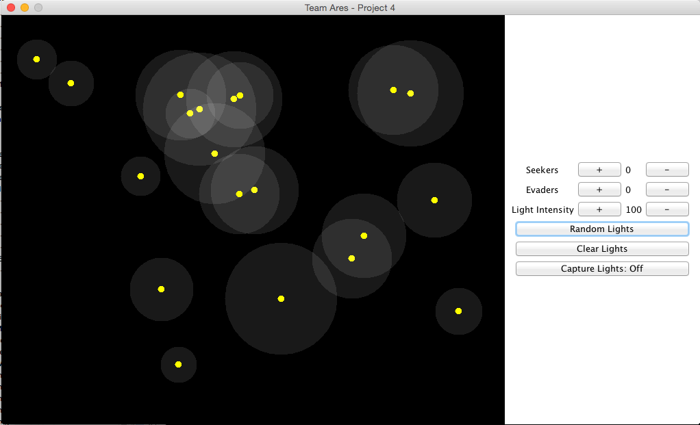

## CSCE-452-Project-4

Code by Esteban Solis and Robert Timm

Avoiders and Seekers is a program that demotrates braitenberg vehicles. Green vehicles are our light seekers and blue vehicles are our light evaders. You can add many of each or indivual groups of varying sizes. Vehicles will simulate avoiding or seeking random light sources added to the screen. The varying intensities of lights simulate the range in which a vehicle front facing sensors interact with the light source. You may also add custom light sources by setting the light intensity and clicking your mouse in the simulation area. Additionally seekers can be set to "collect" lights. When a seeker crosses the origin of a light source it collects the light and gets a speed boost.

### Screenshots

Example of seekers on screen

Example of evaders on screen

Example of random lights on screen

### Compile & Run
* From your terminal clone this repo.
* Navigate terminal into `src` directory.
* Type `make`
* To run type: `java Main`
